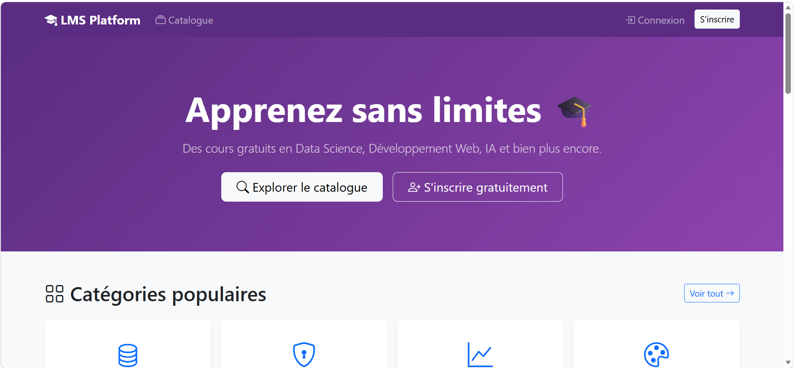
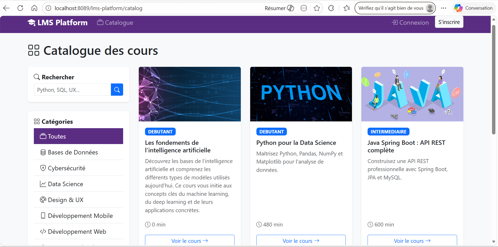
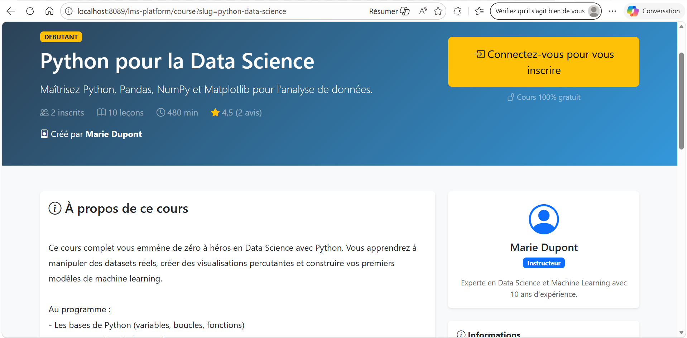
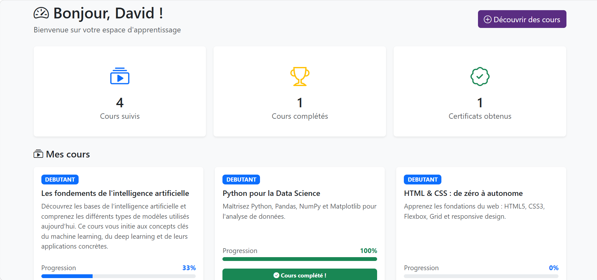
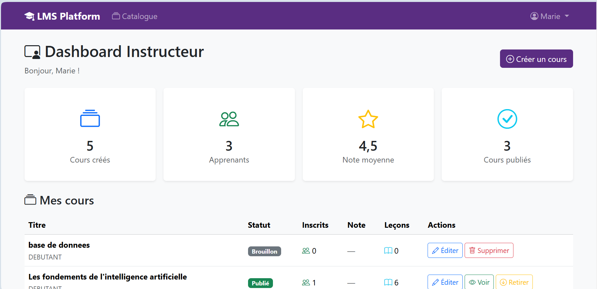
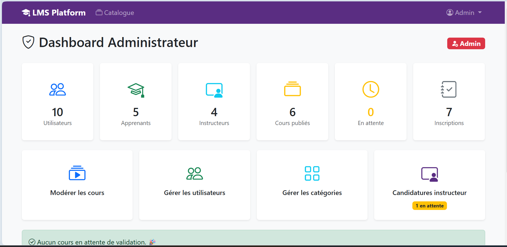
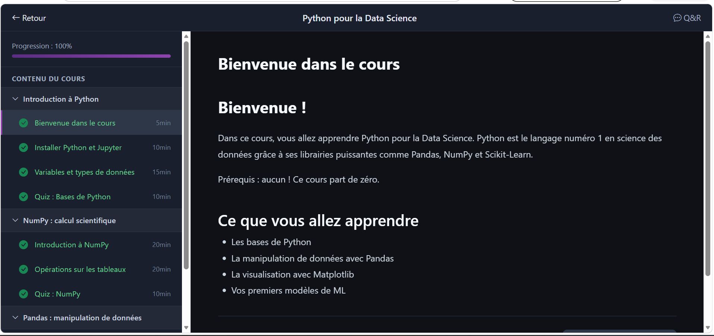
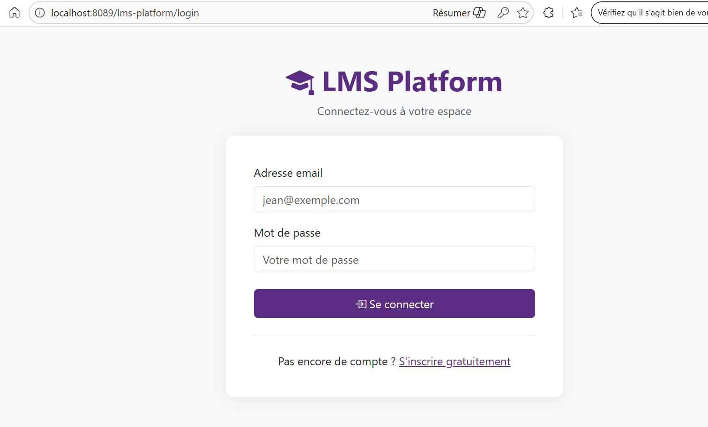

# 🎓 LMS Platform

> Plateforme d'apprentissage en ligne inspirée d'Udemy, développée en Java pur sans framework.  
> Projet académique — ISMAGI 2025/2026


---

## 📋 Sommaire 

- [Aperçu](#-aperçu)
- [Fonctionnalités](#-fonctionnalités)
- [Stack technique](#️-stack-technique)
- [Architecture](#-architecture)
- [Installation](#-installation)
- [Configuration](#-configuration)
- [Comptes de test](#-comptes-de-test)
- [Auteur](#-auteur)

---

## 🖥️ Aperçu

LearnHub est une plateforme LMS (Learning Management System) complète permettant à des apprenants de suivre des cours en ligne, à des instructeurs de créer et publier du contenu, et à des administrateurs de modérer la plateforme.

---

## 🚀 Fonctionnalités

### Apprenants
- Inscription et connexion sécurisée (BCrypt)
- Catalogue de cours avec recherche full-text et filtres par catégorie / niveau
- Lecteur de cours multi-format : vidéo YouTube/Vimeo/MP4, texte HTML, ressources téléchargeables
- Suivi de progression granulaire par leçon
- Quiz interactifs avec score automatique et seuil de validation configurable
- Génération automatique de **certificat PDF** à 100% de complétion
- Système de notes et avis (1 à 5 étoiles)
- Forum Q&R par cours

### Instructeurs
- Création et édition de cours (titre, description, miniature, niveau, catégorie)
- Éditeur de curriculum : sections → leçons (drag & drop ordre)
- Éditeur de quiz avec gestion des questions et réponses
- Dashboard avec statistiques : inscrits, note moyenne, taux de complétion
- Candidature instructeur soumise à validation admin

### Administrateurs
- Dashboard avec vue globale (utilisateurs, cours, certificats)
- Modération des cours (valider / rejeter / archiver / désarchiver)
- Gestion des utilisateurs (suspendre / activer / promouvoir instructeur)
- Gestion des catégories
- Traitement des candidatures instructeur

---

## 🛠️ Stack technique

| Couche | Technologie | Version |
|--------|-------------|---------|
| Langage | Java | 21 |
| Web | Servlets + JSP + JSTL | Servlet 6.0 |
| Persistance | JDBC pur (pas d'ORM) | — |
| Base de données | MySQL | 8.0 |
| Pool de connexions | HikariCP | 5.x |
| Serveur | Apache Tomcat | 10.1 |
| Build | Maven | 3.x |
| Sécurité | BCrypt (jBCrypt) | — |
| Génération PDF | iText | 5.x |
| Logs | Log4j2 | 2.x |
| UI | Bootstrap 5 + Bootstrap Icons | 5.3 |

---

## 📁 Architecture

```
src/main/
├── java/com/formation/lms/
│   ├── controllers/        # Servlets (un par fonctionnalité)
│   │   ├── auth/           # LoginServlet, RegisterServlet, LogoutServlet
│   │   ├── student/        # DashboardServlet, LearnServlet, QuizServlet...
│   │   ├── instructor/     # InstructorDashboardServlet, CurriculumServlet...
│   │   └── admin/          # AdminUsersServlet, AdminCoursesServlet...
│   ├── dao/                # Interfaces + implémentations JDBC
│   │   ├── interfaces/     # ICoursDAO, IUtilisateurDAO, ILeconDAO...
│   │   └── impl/           # CoursDAOImpl, UtilisateurDAOImpl...
│   ├── models/             # POJOs : Cours, Utilisateur, Lecon, Quiz...
│   ├── services/           # Logique métier (CertificatService, etc.)
│   ├── filters/            # AuthFilter, RoleFilter
│   └── utils/              # DBConnection (HikariCP), PasswordUtils...
│
└── webapp/
    ├── assets/
    │   ├── css/            # lms-style.css (design system custom)
    │   └── js/             # lms-main.js
    ├── uploads/            # Fichiers uploadés (avatars, miniatures, CV...)
    └── WEB-INF/
        ├── views/
        │   ├── layouts/    # header.jsp, navbar.jsp, footer.jsp
        │   ├── public/     # home.jsp, catalog.jsp, course-detail.jsp
        │   ├── auth/       # login.jsp, register.jsp
        │   ├── student/    # dashboard.jsp, learn.jsp, profile.jsp...
        │   ├── instructor/ # dashboard.jsp, curriculum.jsp...
        │   └── admin/      # dashboard.jsp, users.jsp, courses.jsp...
        └── web.xml
```

---

## ⚙️ Installation

### Prérequis

- Java 21+
- Apache Tomcat 10.1+
- MySQL 8.0+
- Maven 3.8+

### Étapes

**1. Cloner le projet**
```bash
git clone https://github.com/votre-username/lms-platform.git
cd lms-platform
```

**2. Créer la base de données**
```bash
mysql -u root -p < src/main/resources/sql/schema.sql
mysql -u root -p lms_db < src/main/resources/sql/02_seed.sql
```

**3. Configurer la connexion**

Copier et éditer le fichier de configuration :
```bash
cp src/main/resources/db.properties.example src/main/resources/db.properties
```

**4. Compiler et déployer**
```bash
mvn clean package
cp target/lms-platform.war $TOMCAT_HOME/webapps/
```

**5. Démarrer Tomcat**
```bash
$TOMCAT_HOME/bin/startup.sh   # Linux/Mac
$TOMCAT_HOME/bin/startup.bat  # Windows
```

**6. Accéder à l'application**

---

## 🔧 Configuration

Fichier `src/main/resources/db.properties` :

```properties
db.url=jdbc:mysql://localhost:3306/lms_db?useSSL=false&serverTimezone=UTC
db.username=root
db.password=votre_mot_de_passe
db.pool.size=10
```

---

## 👤 Comptes de test

| Rôle | Email | Mot de passe |
|------|-------|--------------|
| Admin | admin@lms-platform.com | password123 |
| Instructeur | marie.dupont@email.com  | password123 |
| Apprenant | david.test@email.com | password123 |

---

## 📸 Captures d'écran

**Pages publiques**
| Accueil | Catalogue | Détail cours |
|---|---|---|
|  |  |  |

**Espaces utilisateurs**
| Dashboard Étudiant | Dashboard Instructeur | Dashboard Admin |
|---|---|---|
|  |  |  |

**Apprentissage**
| Lecteur de cours | Login |
|---|---|
|  |  |
---

## 🗃️ Schéma de base de données

Les tables principales :

## 🗃️ Schéma de base de données

```
utilisateurs ──< inscriptions >── cours
                                    │
cours ──< sections ──< lecons       │
cours ──< avis                      │
cours ──< questions_qa              │
lecons ──< quiz ──< questions       │
inscriptions ──< progressions_lecon │
inscriptions ──< certificats ────────
```
---

## 🔐 Sécurité

- Mots de passe hashés avec **BCrypt** (facteur de coût 12)
- Filtres de sécurité sur toutes les routes protégées (`AuthFilter`, `RoleFilter`)
- Protection CSRF basique via vérification des méthodes HTTP
- Validation des uploads (type MIME, taille max 5 Mo)
- Aucune donnée sensible en session (seulement l'ID utilisateur)

---

## 👨‍💻 Auteur

**Tassembedo Ulrich David**  
Étudiant en Data Science & IA — ISMAGI  
📧 tass.u.david@gmail.com  
🔗 [LinkedIn](https://www.linkedin.com/in/ulrich-david-tassembedo-5b5962335/)

---

## 📄 Licence

Ce projet est développé dans le cadre d'un projet académique.